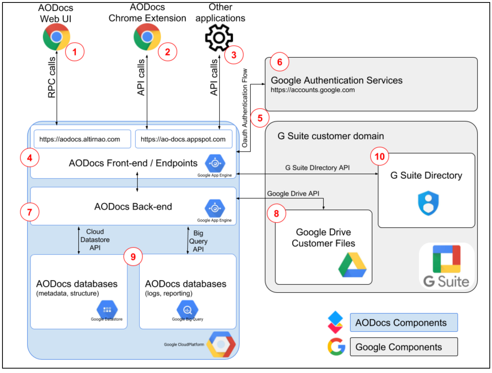

# Overview

Just like _manually_ with the AODocs UI, AODocs APIs let you _programmatically_ access, manage, and configure AODocs objects and their associated metadata, including libraries, classes, documents, attachments, and properties.

The APIs also let you interact indirectly with some AODocs-related [Google Drive API](https://developers.google.com/drive/api/v3/about-sdk) functionality, including some mediated access to files and folders in Drive.

Here in the *Key concepts* section you can read more about [basic AODocs concepts](/docs/aodocs-staging.altirnao.com/1/c/Fundamentals/Basic%20of%20AODocs) and about how you can leverage [the fundamentals of AODocs APIs](/docs/aodocs-staging.altirnao.com/1/c/Fundamentals/Basic%20of%20AODocs%20APIs) to accomplish your goals.

---

# Overview

Just like _manually_ with the AODocs UI, AODocs APIs let you _programmatically_ access, manage, and configure AODocs objects and their associated metadata, including libraries, classes, documents, attachments, and properties.

> ⭑   **Note**: A NOTE ABOUT SERVICE ACCOUNTS?   .

The APIs also let you interact indirectly with some AODocs-related [Google Drive API](https://developers.google.com/drive/api/v3/about-sdk) functionality, including some mediated access to files and folders in Drive.

In the _Key concepts_ section you can read more about [AODocs basics](https://api.aodocs-staging.com/docs/aodocs-staging.altirnao.com/1/c/Fundamentals/Basic%20of%20AODocs) as well as about how you can leverage [concepts and components of AODocs APIs](https://api.aodocs-staging.com/docs/aodocs-staging.altirnao.com/1/c/Fundamentals/Basic%20of%20AODocs%20APIs) to accomplish your goals.

The following diagram shows the interactions between the major components:

root-relative link

relative link

**Figure 1**: AODocs architecture diagram (AODocs components in blue, Google components in gray)

The following terms define key components shown in Figure 1:

#####################################################

BELOW IS COPYPASTA FROM [Introduction to Google Drive API](https://developers.google.com/drive/api/v3/about-sdk)

**_Google Drive_**

Google's cloud file storage service that provides users with a personal storage space, called _My Drive_, and the option to access collaborative shared folders, called _shared drives_.

**_Google Drive API_**

The REST API that allows you to leverage Google Drive storage from within your app.

**_Google Drive app_**

An app that leverages Google Drive as its storage solution.

**_Google Drive UI_**

Google's user interface that manages files stored on Google Drive. If your app is an editor-type app, such as a spreadsheet or word processor app, you can integrate with the Drive UI to create and open files within your app.

**_My Drive_**

A Google Drive storage location that a specific user owns. Files stored on My Drive can be shared with other users, but ownership of the content remains specific to an individual user.

**_OAuth 2.0_**

The authorization protocol that Google Drive API requires to authenticate your app users. If your application uses [Google Sign-in](https://developers.google.com/identity/sign-in/web/sign-in), it handles the OAuth 2.0 flow and application access tokens.

**_Shared drive_**

A Google Drive storage location that owns files that multiple users share to collaborate. Any user with access to a shared drive has access to all files it contains. Users can also be granted access to individual files inside the shared drive.

<!-- Docs to Markdown version 1.0β20 -->
