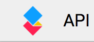

# Test page (of markdown syntax, links, etc.)

## Summary of hypermedia linking support on API doc portal

---

### MD

#### Allowed
* linking directly to file using relative links (but NOT root-relative links — unlike images which have support for both)
  * [../../Guides/00-Getting started.md](../../Guides/00-Getting%20Started)

#### Disallowed
* linking to page using root-relative links
  * [/Guides/00-Getting started.md](/Guides/00-Getting%20Started)

* everything else

---

### DOCX, TXT, and presumably all other types of files

#### Allowed

* nothing

#### Disallowed

* everything: clicking, right-clicking — it all yields zero results

---

### JSON

#### Allowed
* download a file (but its contents will just be the word "Loading...")

#### Disallowed
* everything else (view in browser, open in new tab, etc.)

---

### PNG

#### Allowed
* display inline
  * using relative link: 
  * using root-relative link: 
* right-click on an already-displayed image (relative or root-relative) and "Save Image As" or "Open Image In A New Tab" (the latter giving a URL like [blob:https://api.aodocs-staging.com/b99ea21a-3339-47d2-8263-e0fc35778053](blob:https://api.aodocs-staging.com/b99ea21a-3339-47d2-8263-e0fc35778053) )
  * using relative link: 
  * using root-relative link: 

#### Disallowed
* hotlink/blob link/click on link to get to image directly
    * relative: [../../dls/api.png as a link](../../dls/api.png "../../dls/api.png as a link")
    * root-relative: [/dls/api.png as a link](/dls/api.png "/dls/api.png as a link")
    * 
    * [direct blob link as a link, minus the blob part: https://api.aodocs-staging.com/31697444-378d-49a9-84a2-393731a1cd68](https://api.aodocs-staging.com/31697444-378d-49a9-84a2-393731a1cd68)
    * 
    * [direct blob link as a link, with the blob part: blob:https://api.aodocs-staging.com/31697444-378d-49a9-84a2-393731a1cd68](blob:https://api.aodocs-staging.com/31697444-378d-49a9-84a2-393731a1cd68)

* right-click on hyperlink and "Save Link As" or "Open Link In A New Tab"
    * relative: [../../dls/api.png as a link](../../dls/api.png "../../dls/api.png as a link")
    * root-relative: [/dls/api.png as a link](/dls/api.png "/dls/api.png as a link")

---

---

---

## Test dump (ignore)

Tests of relative and root-relative links to [https://api.aodocs-staging.com/docs/aodocs-staging.altirnao.com/1/c/Guides/00-Getting%20Started](https://api.aodocs-staging.com/docs/aodocs-staging.altirnao.com/1/c/Guides/00-Getting%20Started):

> **Note**: Except where otherwise noted, **nothing** below works whether by clicking or trying to download:

[/Guides/00-Getting started.md](/Guides/00-Getting%20Started)

`WORKS`: [../../Guides/00-Getting started.md](../../Guides/00-Getting%20Started)

---

[/dls/00-Overview.md](/dls/00-Overview)

`WORKS`: [../../dls/00-Overview.md](../../dls/00-Overview)

---

[/dls/tree.txt](/dls/tree.txt)

[../../dls/tree.txt](../../dls/tree.txt)

[api.aodocs-staging.com/docs/aodocs-staging.altirnao.com/1/c/dls/tree.txt](api.aodocs-staging.com/docs/aodocs-staging.altirnao.com/1/c/dls/tree.txt)

[//api.aodocs-staging.com/docs/aodocs-staging.altirnao.com/1/c/dls/tree.txt](api.aodocs-staging.com/docs/aodocs-staging.altirnao.com/1/c/dls/tree.txt)

[api.aodocs-staging.com/docs/aodocs-staging.altirnao.com/1/dls/tree.txt](api.aodocs-staging.com/docs/aodocs-staging.altirnao.com/1/c/dls/tree.txt)

[//api.aodocs-staging.com/docs/aodocs-staging.altirnao.com/1/dls/tree.txt](api.aodocs-staging.com/docs/aodocs-staging.altirnao.com/1/c/dls/tree.txt)

---

[/dls/test.json](../../dls/test.json)

[../../dls/test.json](../../dls/test.json)

---

[../../dls/api.png as a link](../../dls/api.png "../../dls/api.png as a link")

`WORKS: ../../dls/api.png as an image`:

---

[/dls/api.png as a link](/dls/api.png "/dls/api.png as a link")

`WORKS: /dls/api.png as an image`:

---

## Direct BLOB link {: #direct-blob-link }

[direct blob link as a link, minus the blob part: https://api.aodocs-staging.com/31697444-378d-49a9-84a2-393731a1cd68](https://api.aodocs-staging.com/31697444-378d-49a9-84a2-393731a1cd68)

[direct blob link as a link, with the blob part: blob:https://api.aodocs-staging.com/31697444-378d-49a9-84a2-393731a1cd68](blob:https://api.aodocs-staging.com/31697444-378d-49a9-84a2-393731a1cd68)

## formula test

$-b \pm \sqrt{b^2 - 4ac} \over 2a$

## icon test

trying out some things from the following pages:
* [https://cloud.google.com/shell/docs/walkthroughs](https://cloud.google.com/shell/docs/walkthroughs)
* [https://cloud.google.com/shell/docs/walkthrough-markdown-reference](https://cloud.google.com/shell/docs/walkthrough-markdown-reference)
* [https://cloud.google.com/monitoring/alerts/doc-variables](https://cloud.google.com/monitoring/alerts/doc-variables)

<walkthrough-inline-icon-name>cloud-shell-icon</walkthrough-inline-icon-name>

<cloud-shell-icon></cloud-shell-icon>

<walkthrough-editor-open-file filePath="path/to/test.md"
                              text="Open sample file">
</walkthrough-editor-open-file>